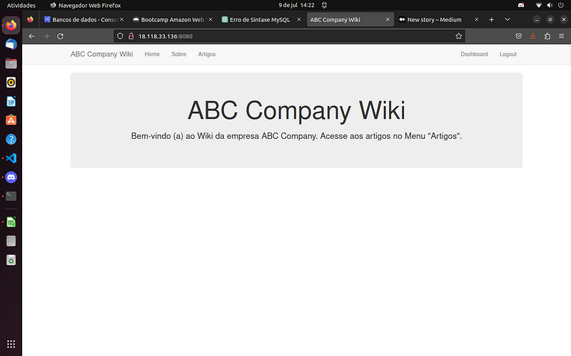

  <h1 align="center">Migração de um Workload rodando em um Data Center Corporativo para a AWS utilizando o serviço do Amazon EC2 e RDS</h1>

## Descrição do projeto:
Em mais um projeto baseado em um cenário do mundo real, atuei como Especialista Cloud na migração de workload rodando em um DataCenter Corporativo para a da AWS.
 Conforme planejamento, a aplicação e o banco de dados da aplicação foram migrados para a AWS usando o modelo Lift & Shift (rehost), movendo tanto os dados da aplicação como do banco de dados.
Segui algumas etapas de migração, como: Planejamento (sizing, pré-requisitos, nomenclatura dos recursos), Execução (provisionamento dos recursos, melhores práticas), Go-live (teste de validação - Dry-run, migração final - Cutover) e Pós Go-live (garantir o funcionamento da aplicação e acesso dos usuários).

Subnet (Public Subnet)
Auto-assign public IP: Enable
Firewall (security groups): app01-sg [ Portas: 22 | 8080 ]

Como ficou:

- Criar BD RDS:
• RDS | Create database
• Standard create
• MySql | Version: MySql 5.7.37
• Template: Free Tier
• DB instance identifier: awsuse2db01
• Credentials Settings: admin | admin123456
• DB instance class: db.t2.microls
Connectivity
VPC: vpc-bootcamp
• VPC security group: mantém a 'default' por enquanto!
• AZ: us-east-1a
• Database port: 3306 (Additional configuration)

Como ficou:

Parte 2: Instalação e Configuração dos Pacotes para App e conexão com o BD
- Criar Internet Gateway, Atachar na VPC e Criar uma Rota
• VPC | Internet Gateway: igw-mod3 | Action: Attach to VPC (vpc-bootcamp)
• VPC | Route Table | Routes | Edit routes |
Add route: 0.0.0.0/0 - Target: Internet Gateway (igw-mod3)
ssh -i chavessh ubuntu@ip-publico-ec2 

- Instalar aplicação e suas dependências na instâncias EC2 
"Ubuntu 22.04" emite 'pop-ups' após instalar/atualizar pacotes requisitando:
"Which service should be restarted ?"
"Quais serviços devem ser reinicializados?"
Por padrão, isso é definido no modo "interativo", o que causa a interrupção dos scripts.
Para alterar esse comportamento,
podemos editar o arquivo /etc/needrestart/needrestart.conf, alterando a linha:
cat /etc/needrestart/needrestart.conf | grep -i nrconf{restart}

De:
#$nrconf{restart} = 'i';
Para:
$nrconf{restart} = 'a';
'i' interativo | 'a' automatically

Usaremos o comando 'sed' para fazer essa alteração:
sudo sed -i "/#\$nrconf{restart} = 'i';/s/.*/\$nrconf{restart} = 'a';/" /etc/needrestart/needrestart.conf
cat /etc/needrestart/needrestart.conf | grep -i nrconf{restart}

sudo apt update
sudo apt install python3-dev -y
sudo apt install python3-pip -y
sudo apt install build-essential libssl-dev libffi-dev -y
sudo apt install libmysqlclient-dev -y
sudo apt install unzip -y
sudo apt install libpq-dev libxml2-dev libxslt1-dev libldap2-dev -y
sudo apt install libsasl2-dev libffi-dev -y
pip3 install flask
Warning…
export PATH=$PATH:/home/ubuntu/.local/bin/
pip3 install wtforms
sudo apt install pkg-config
pip3 install flask_mysqldb
pip3 install passlib
- Instalação do MySql Client: 
sudo apt-get install mysql-client -y

Parte 3: Go Live
- Criar Security Group para o RDS | VPC | SG
• Name: EC2toRDS-sg
• Description: SG para permitir acesso ao MySQL atraves da aplicacao rodando no EC2.
• VPC: vpc-bootcamp
• Inbound rules | Add rule | Type: MYSQL/Aurora | Source: 0.0.0.0/0

- Associar SG (EC2toRDS-sg) na instância RDS (awsuse1db01):
• RDS | DB Instances | awsuse1db01 | Modify
• Connectivity | SG: EC2toRDS-sg
• Continue… Apply immediately e "Modify DB instance"
- Conectar na instância VM - EC2 usando a chave privada: 'chavessh'
• ssh -i chavessh ubuntu@ip-publico-ec2
- Download dos arquivos da Aplicação e Dump' do Banco de Dados
• wget https://aws-mod3.s3.amazonaws.com/wikiapp.zip
• wget https://aws-mod3.s3.amazonaws.com/dump.sql
- Conectar no servidor MySQL no AWS RDS
• Copie o Endpoint do seu RDS
mysql -h <endpoint_do_rds> -P 3306 -u admin -p
EXEMPLO: mysql -h awsuse1db01.culdx6558fqq.us-east-1.rds.amazonaws.com -P 3306 -u admin -p
• Senha: admin123456
- Criar o banco de dados 'wikidb' e importar os dados
• show databases;
• create database wikidb;
• show databases;
• use wikidb;
• show tables;
• source dump.sql;
• show tables;
• select * from articles;
- Criar usuário wiki no Banco de Dados wikidb
• CREATE USER wiki@'%' IDENTIFIED BY 'admin123456';
• GRANT ALL PRIVILEGES ON wikidb.* TO wiki@'%';
• FLUSH PRIVILEGES;
• EXIT;
- Fazer unzip dos arquivos de aplicação
• unzip wikiapp.zip
- Editar o arquivo Python 'wiki.py'
e mudar o nome do host para o 'enpoint do RDS' e 'usuário do BD'
• cd wikiapp/
• vi wiki.py
► sessão '# Config MySQL'
• 'MYSQL_HOST' = 'awsuse1db01.cfhprbugweo6.us-east-1.rds.amazonaws.com' [EXEMPLO]
• 'MYSQL_USER' = 'wiki'
- Subir a aplicação:
• python3 wiki.py
- Passos de validação da migração:
• Abrir a console da AWS, copiar o IP Público da instância EC2, abrir o browser em uma nova aba e digitar:
• <IP_PUBLICO_EC2>:8080
• Login: admin / admin
Evidência do Projeto

